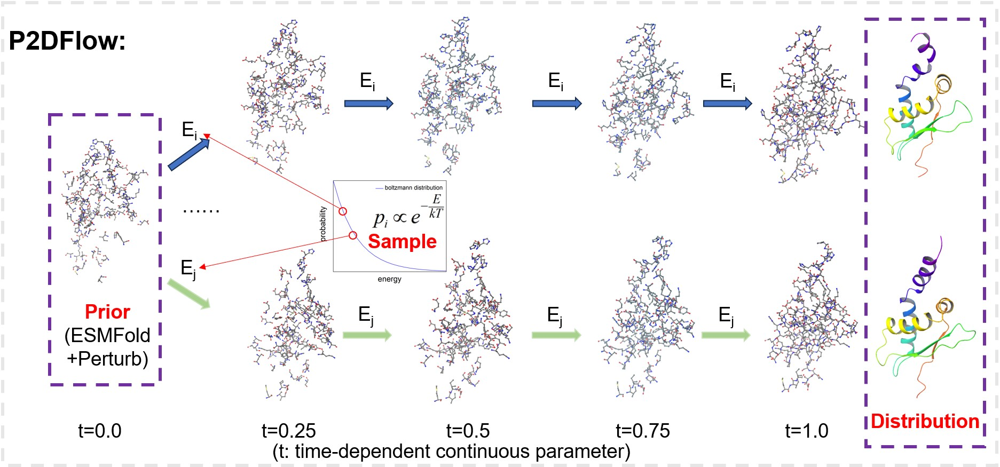

# P2DFlow

P2DFlow is a protein ensemble generative model with SE(3) flow matching based on ESMFold, the ensembles generated by P2DFlow could aid in understanding protein functions across various scenarios.

Technical details and evaluation results are provided in our paper:
* [P2DFlow: A Protein Ensemble Generative Model with SE(3) Flow Matching](https://arxiv.org/abs/2411.17196)

<p align="center">
    
</p>


## Table of Contents
1. [Installation](#Installation)
2. [Prepare Dataset](#Prepare-Dataset)
3. [Model weights](#Model-weights)
4. [Training](#Training)
5. [Inference](#Inference)
6. [Evaluation](#Evaluation)
7. [License](#License)
8. [Citation](#Citation)


## Installation
In an environment with cuda 11.7, run:
```
conda env create -f environment.yml
```
To activate the environment, run:
```
conda activate P2DFlow
```

## Prepare Dataset
#### (tips: If you want to use the data we have preprocessed, please go directly to `3. Download selected dataset`; if you prefer to process the data from scratch or work with your own data, please start from the beginning)
#### 1. Download raw ATLAS dataset
(i) Download the `Analysis & MDs` dataset from [ATLAS](https://www.dsimb.inserm.fr/ATLAS/), or you can use `./dataset/download.py` by running:
```
python ./dataset/download.py
```
We will use `.pdb` and `.xtc` files for the following calculation.

#### 2. Calculate the 'approximate energy and select representative structures
(i) Use `gaussian_kde` to calculate the 'approximate energy':
```
python ./dataset/traj_analyse.py
```
And you will get `traj_info.csv`.

(ii) Select representative structures at equal intervals based on the 'approximate energy':
```
python ./dataset/md_select.py
```

#### 3. Download selected dataset

(i) Download the selected dataset (or get it from the two steps above) from [Google Drive](https://drive.google.com/drive/folders/11mdVfMi2rpVn7nNG2mQAGA5sNXCKePZj?usp=sharing) whose filename is `selected_dataset.tar`, and decompress it using:
```
tar -xvf select_dataset.tar
```
(ii) Preprocess `.pdb` files to get `.pkl` files:
```
python ./data/process_pdb_files.py --pdb_dir ${pdb_dir} --write_dir ${write_dir}
```
And you will get `metadata.csv`.

then compute node representation and pair representation using ESM-2 (`csv_path` is the path of `metadata.csv`):
```
python ./data/cal_repr.py --csv_path ${csv_path}
```
then compute predicted static structure using ESMFold (`csv_path` is the path of `metadata.csv`):
```
python ./data/cal_static_structure.py --csv_path ${csv_path}
```
(iii) Provide the necessary `.csv` files for training

If you are using the data we have preprocessed, download the `.csv` files from [Google Drive](https://drive.google.com/drive/folders/11mdVfMi2rpVn7nNG2mQAGA5sNXCKePZj?usp=sharing) whose filenames are `train_dataset.csv` and `train_dataset_energy.csv`(they correspond to `csv_path` and `energy_csv_path` in `./configs/base.yaml` during training).

Or if you are using your own data, you can get `metadata.csv` from step 3 (correspond to `csv_path` in `./configs/base.yaml` during training, and you need to split a subset from it as the train dataset), and get `traj_info.csv` from step 2 (correspond to `energy_csv_path`).


## Model weights
Download the pretrained checkpoint from [Google Drive](https://drive.google.com/drive/folders/11mdVfMi2rpVn7nNG2mQAGA5sNXCKePZj?usp=sharing) whose filename is `pretrained.ckpt`, and put it into `./weights` folder. You can use the pretrained weight for inference.


## Training
To train P2DFlow, firstly make sure you have prepare the dataset according to `Prepare Dataset`, and put it in the right folder, then modify the config file in `./configs/base.yaml`(especially for `csv_path` and `energy_csv_path`). After this, you can run:
```
python experiments/train_se3_flows.py
```
And you will get the checkpoints in `./ckpt`.


## Inference
To infer for specified protein sequence, firstly modify the input .csv file in `./inference/valid_seq.csv` and config file in `./configs/inference.yaml`(especially for `validset_path`), then run:
```
python experiments/inference_se3_flows.py
```
And you will get the results in `./inference_outputs/weights/`.


## Evaluation
* Coming soon!


## License
This project is licensed under the terms of the GPL-3.0 license.


## Citation
```
@article{jin2024p2dflow,
  title={P2DFlow: A Protein Ensemble Generative Model with SE(3) Flow Matching},
  author={Yaowei Jin, Qi Huang, Ziyang Song, Mingyue Zheng, Dan Teng, Qian Shi},
  journal={arXiv preprint arXiv:2411.17196},
  year={2024}
}
```
